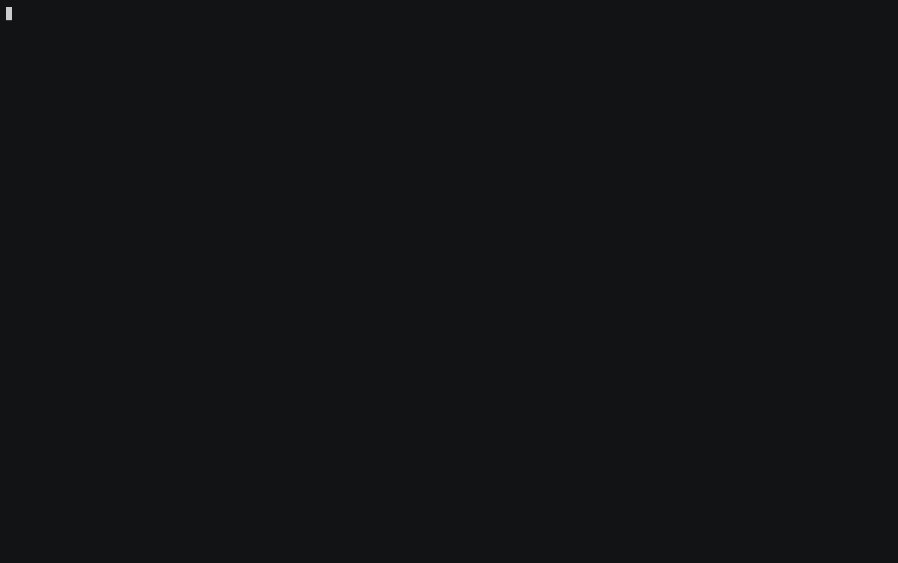

# perl-lsp

A Perl language server with deep semantic intelligence. Built on [tree-sitter-perl](https://github.com/tree-sitter-perl/tree-sitter-perl) and tower-lsp.

[](https://crates.io/crates/perl-lsp) [](https://github.com/tree-sitter-perl/perl-lsp/actions/workflows/ci.yml) [](https://marketplace.visualstudio.com/items?itemName=tree-sitter-perl.vscode-perl-lsp) [](LICENSE)



*Hover infers `$acct` is an `Account` through the imported `make_account()`; goto-def jumps into `Bank.pm`; completion lists the class's methods; renaming the accessor cascades across files. ([demo/](demo/))*

## Install

```bash
cargo install perl-lsp
```

## Editor Setup

### VS Code

Install **[Perl (perl-lsp)](https://marketplace.visualstudio.com/items?itemName=tree-sitter-perl.vscode-perl-lsp)** from the Marketplace (or search `perl-lsp` in the Extensions view). The extension fetches the matching `perl-lsp` binary automatically — no separate `cargo install` needed. To point it at your own build instead, set `perl-lsp.path` in settings.

> The `cargo install` above is only needed for the other editors below, or if you prefer to manage the binary yourself.

### Neovim (0.11+)

```lua
vim.lsp.config["perl-lsp"] = {
  cmd = { "perl-lsp" },
  filetypes = { "perl" },
  root_markers = { "cpanfile", "Makefile.PL", "Build.PL", ".git" },
}
vim.lsp.enable("perl-lsp")
```

### Neovim (0.10 or earlier)

```lua
vim.api.nvim_create_autocmd("FileType", {
  pattern = "perl",
  callback = function()
    vim.lsp.start({
      name = "perl-lsp",
      cmd = { "perl-lsp" },
      root_dir = vim.fs.root(0, { "cpanfile", "Makefile.PL", "Build.PL", ".git" }),
    })
  end,
})
```

### Helix

Add to `~/.config/helix/languages.toml`:

```toml
[language-server.perl-lsp]
command = "perl-lsp"

[[language]]
name = "perl"
language-servers = ["perl-lsp"]
```

### Emacs (eglot)

```elisp
(add-to-list 'eglot-server-programs '(perl-mode . ("perl-lsp")))
```

### Claude Code

perl-lsp is published to the [Piebald LSP marketplace](https://github.com/Piebald-AI/claude-code-lsps), giving Claude Code real-time Perl intelligence (type inference, navigation, framework awareness). With `perl-lsp` on your `PATH`, add the marketplace and install the plugin:

```
/plugin marketplace add Piebald-AI/claude-code-lsps
/plugin install perl-lsp@claude-code-lsps
```

The server starts automatically when you open a Perl file. The plugin is configuration only — it speaks to the `perl-lsp` you installed above and downloads nothing on its own.

### Semantic Token Colors (Neovim)

perl-lsp emits rich semantic tokens. Add these to your config for the best experience:

```lua
vim.api.nvim_set_hl(0, "@lsp.type.macro.perl", { link = "Keyword" })      -- has, with, extends
vim.api.nvim_set_hl(0, "@lsp.type.property.perl", { link = "Identifier" }) -- hash keys
vim.api.nvim_set_hl(0, "@lsp.type.namespace.perl", { link = "Type" })     -- Foo::Bar
vim.api.nvim_set_hl(0, "@lsp.type.parameter.perl", { link = "Special" })  -- sub params
vim.api.nvim_set_hl(0, "@lsp.type.keyword.perl", { link = "Constant" })   -- $self/$class
vim.api.nvim_set_hl(0, "@lsp.mod.scalar.perl", { fg = "#61afef" })        -- $ blue
vim.api.nvim_set_hl(0, "@lsp.mod.array.perl", { fg = "#c678dd" })         -- @ purple
vim.api.nvim_set_hl(0, "@lsp.mod.hash.perl", { fg = "#e5c07b" })          -- % gold
vim.api.nvim_set_hl(0, "@lsp.mod.modification.perl", { fg = "#e06c75" })  -- writes in red
vim.api.nvim_set_hl(0, "@lsp.mod.declaration.perl", { bold = true })
vim.api.nvim_set_hl(0, "@lsp.mod.readonly.perl", { italic = true })
vim.api.nvim_set_hl(0, "@lsp.mod.defaultLibrary.perl", { italic = true }) -- imported functions
```

## Features

### Type Inference

No annotations needed. perl-lsp infers types from how your code uses values:

- `Foo->new()` → `$obj` is `ClassName(Foo)`
- `$obj->{key}` → `$obj` is HashRef
- `$x + 1` → `$x` is Numeric
- Method chains propagate: `$self->get_config()->{host}` resolves through return types
- Cross-file: return types and parameter types flow across module boundaries

### Framework Intelligence

| Framework | What perl-lsp understands |
|-----------|--------------------------|
| **Moo/Moose** | `has` accessor synthesis with `is`/`isa` type mapping, getter/setter arity, `extends`/`with` for inheritance and roles |
| **Mojo::Base** | Accessor synthesis with default value type inference, fluent setter chaining, parent class detection |
| **DBIC** | `add_columns` column accessors, `has_many`/`belongs_to`/`has_one` relationship accessors, `load_components` mixin resolution |
| **Perl 5.38 `class`** | `field` with `:param`/`:reader`/`:writer`, `:isa(Parent)`, `:does(Role)`, implicit `$self` |

Framework DSL keywords (`has`, `with`, `extends`, `around`, etc.) are recognized and won't trigger unresolved-function diagnostics.

### Constant Folding + Dynamic Dispatch

```perl
my $method = "get_$field";
$self->$method();          # goto-def works — resolves through the constant
```

perl-lsp folds `use constant`, package-scope variables, string interpolation, and loop variables. Dynamic method calls via `$self->$var()` resolve to their targets.

### Cross-File Intelligence

- Module resolution from `@INC` + cpanfile dependencies
- **Auto-discovers `lib/` and `local/lib/perl5/`** relative to workspace root — no `PERL5LIB` needed for standard project layouts (cpm, carton, plain `lib/`)
- Inheritance chain walking (DFS, roles, mixins, `load_components`)
- Return type and parameter type propagation across files
- Cross-file rename: 289 edits across 56 files in Mojolicious in <1 second
- SQLite cache for instant repeat resolution
- Workspace indexing via Rayon: 274-file Mojolicious in 204ms

### Module Discovery

perl-lsp finds your modules automatically:

1. **`lib/`** and **`local/lib/perl5/`** in your project root (auto-discovered)
2. **`@INC`** from your Perl installation (via `perl -e 'print join "\n", @INC'`)
3. **`PERL5LIB`** if set in your environment
4. **cpanfile** dependencies pre-resolved at startup

For non-standard layouts, set `PERL5LIB` before launching your editor:

```bash
PERL5LIB=./my-libs/perl5 nvim lib/MyApp.pm
```

### LSP Capabilities

| Capability | Highlights |
|-----------|-----------|
| **Completion** | Variables, methods (type-inferred), hash keys, auto-import, module names on `use` lines, import lists in `qw()` |
| **Go-to-definition** | Scope-aware variables, cross-file methods via inheritance, hash keys through expression chains |
| **Find references** | Scope-aware variables, cross-file functions/methods/packages |
| **Rename** | Variables (scope-aware), functions/methods/packages (cross-file via workspace index) |
| **Hover** | Types, POD docs (tree-sitter-pod AST), signatures, class provenance |
| **Signature help** | Parameter names with inferred types, cross-file parameter types |
| **Semantic tokens** | 10 types (variable, parameter, `$self`, function, method, macro, property, namespace, regexp, constant), 9 modifiers |
| **Inlay hints** | Variable type annotations, sub return types |
| **Diagnostics** | Unresolved function/method hints with framework awareness (low-severity by design — dynamic Perl is common) |
| **Code actions** | Auto-import for unresolved functions |
| **Workspace symbol** | Search across all indexed project files |
| **Document symbols** | Nested outline with packages, subs, classes, fields |
| **Formatting** | perltidy (full document + range) |
| **Highlights** | Read/write distinction |
| **Selection range** | Tree-sitter node hierarchy |
| **Folding** | Blocks, subs, classes, POD |
| **Linked editing** | Simultaneous editing of references in scope |

### POD Documentation

POD is rendered via tree-sitter-pod — proper AST walk, not regex. Handles nested lists, `=begin`/`=end` data regions, multi-angle-bracket formatting (`C<<<  $hash->{key}  >>>`), bold-italic nesting, `L<>` links to metacpan, and `=item`-based method documentation.

## CLI Tools

perl-lsp doubles as a command-line analysis toolkit:

```bash
# Batch diagnostics (CI-ready — resolves imports, uses SQLite cache)
perl-lsp --check [<root>] [--severity error|warning] [--format json|human]
#   Opt-in flow-narrowing lints (default off; LSP: initializationOptions.diagnostics):
#     --optional-deref               unguarded Optional<T> dereference  (optionalDeref)
#     --redundant-guard              always-true / always-false guard   (redundantGuard)
#     --deref-shape                  hash deref on a guarded array/code ref (derefShape)
#     --unresolved-method-cross-file extend unresolved-method cross-file (unresolvedMethodCrossFile)

# Code exploration
perl-lsp --outline <file>
perl-lsp --hover [<root>] <file> <line> <col>   # <root> enables cross-file hover
perl-lsp --type-at <file> <line> <col>
perl-lsp --definition <root> <file> <line> <col>
perl-lsp --references <root> <file> <line> <col>

# Refactoring
perl-lsp --rename <root> <file> <line> <col> <new_name>
perl-lsp --workspace-symbol <root> <query>
```

`--check` resolves modules from `@INC`, uses the per-project SQLite cache, and exits with code 1 if issues are found. Integrate into CI with:

```bash
perl-lsp --check . --severity warning
```

## Server Options

Editor-agnostic settings, passed to the server via LSP `initializationOptions`
(every editor has its own syntax for this — see the per-editor setup above).

| Option | Default | Description |
|--------|---------|-------------|
| `rename.overrideScope` | `"hierarchy"` | How a method that participates in an inheritance hierarchy is scoped for rename (and the references that share its resolution). `"hierarchy"` is the standard IDE refactor: rename the whole override family — the base declaration, every override, and all call sites that dispatch into it. `"dispatch"` is the precise mode: rename only the cursor's own definition plus the call sites that dispatch to *that* definition (including `SUPER::` calls that target it), leaving sibling overrides untouched. Scope is gathered over proven `@ISA`/`use parent`/role edges, never name matches. |
| `diagnostics.unresolvedDispatch` | `false` | Enables the `unresolved-dispatch` diagnostic — flags string-dispatched calls (Mojo events, etc.) whose handler can't be resolved. A QA / plugin-author channel; off by default. |

Example (Neovim `lspconfig`):

```lua
require('lspconfig').perl_lsp.setup({
  init_options = { rename = { overrideScope = 'dispatch' } },
})
```

## Plugins

Framework intelligence (Mojolicious, Minion, …) ships as bundled
[Rhai](https://rhai.rs) plugins. You can add your own: drop any
`*.rhai` file into your project's `.perl-lsp/` directory — auto-discovered
at the workspace root, no configuration needed — and restart the server.
For a personal collection you want loaded across every project, point
`$PERL_LSP_PLUGIN_DIR` at it instead; both directories are searched.
Plugin sources are fingerprinted, so editing one invalidates the
cross-file cache automatically.

### Generating a plugin for an `Import::Base` kit

Most Perl shops centralize their import boilerplate behind a kit
(`use Co::Base -Class;`). `perl-gen/` is a Perl script that reads such
a kit's `@IMPORT_MODULES` / `%IMPORT_BUNDLES` tables and emits a
ready-to-commit `.rhai` plugin so the LSP understands what the kit
imports:

```bash
perl-gen/bin/perl-lsp-gen-importbase Co::Base::Local \
  --lib /path/to/project/lib \
  --alias Co::Base \
  --out "$PERL_LSP_PLUGIN_DIR/co-base.rhai"
```

See `perl-gen/README.md` for full usage and
`docs/adr/importbase-plugin-gen.md` for the design rationale.

## Building from Source

```bash
git clone https://github.com/tree-sitter-perl/perl-lsp
cd perl-lsp
cargo build --release
```

## Testing

```bash
cargo test                                    # 900+ unit tests
cargo build --release && ./e2e/run.sh         # 10 nvim-driven e2e suites (requires nvim)
```

## License

[MIT](LICENSE)
